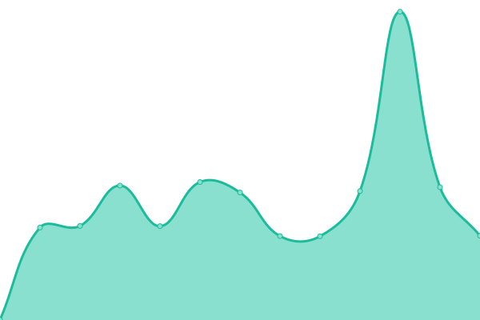

# [📈 Live Status](https://triopsi.github.io/statuspage): <!--live status--> **Alle Systeme sind betriebsbereit**

This repository contains the open-source uptime monitor and status page for [Triopsi](https://www.wiki.profoxi.de), powered by [Upptime](https://github.com/upptime/upptime).

With [Upptime](https://upptime.js.org), you can get your own unlimited and free uptime monitor and status page, powered entirely by a GitHub repository. We use [Issues](https://github.com/triopsi/statuspage/issues) as incident reports, [Actions](https://github.com/triopsi/statuspage/actions) as uptime monitors, and [Pages](https://triopsi.github.io/statuspage) for the status page.

<!--start: status pages-->
<!-- This summary is generated by Upptime (https://github.com/upptime/upptime) -->
<!-- Do not edit this manually, your changes will be overwritten -->
<!-- prettier-ignore -->
| URL | Status | History | Response Time | Uptime |
| --- | ------ | ------- | ------------- | ------ |
|  Triopsi Hosting Webseite | Up | [triopsi-hosting-webseite.yml](https://github.com/triopsi/statuspage/commits/HEAD/history/triopsi-hosting-webseite.yml) | 

 2708ms
     
 | 

<a href="https://status.triopsi-hosting.com/history/triopsi-hosting-webseite">100.00%</a>
    

|  [WEB01](https://admin.triopsi-hosting.com) | Up | [web-01.yml](https://github.com/triopsi/statuspage/commits/HEAD/history/web-01.yml) | 

 1065ms
     
 | 

<a href="https://status.triopsi-hosting.com/history/web-01">100.00%</a>
    

|  [WEB02](https://web02.triopsi-hosting.com:8443) | Up | [web-02.yml](https://github.com/triopsi/statuspage/commits/HEAD/history/web-02.yml) | 

 1003ms
     
 | 

<a href="https://status.triopsi-hosting.com/history/web-02">100.00%</a>
    

|  [Kundeninterface](https://cp.triopsi-hosting.com) | Up | [kundeninterface.yml](https://github.com/triopsi/statuspage/commits/HEAD/history/kundeninterface.yml) | 

 1088ms
     
 | 

<a href="https://status.triopsi-hosting.com/history/kundeninterface">99.47%</a>
    

|  [Webmail-01](https://webmail.triopsi-hosting.com) | Up | [webmail-01.yml](https://github.com/triopsi/statuspage/commits/HEAD/history/webmail-01.yml) | 

 852ms
     
 | 

<a href="https://status.triopsi-hosting.com/history/webmail-01">100.00%</a>
    

|  [Support-System](https://support.triopsi-hosting.com) | Up | [support-system.yml](https://github.com/triopsi/statuspage/commits/HEAD/history/support-system.yml) | 

 719ms
     
 | 

<a href="https://status.triopsi-hosting.com/history/support-system">98.58%</a>
    

|  [Host-01](https://host1.phoenix.com.de:8006) | Up | [host-01.yml](https://github.com/triopsi/statuspage/commits/HEAD/history/host-01.yml) | 

 1324ms
     
 | 

<a href="https://status.triopsi-hosting.com/history/host-01">100.00%</a>
    

|  [Host-02](https://host2.phoenix.com.de:8006) | Up | [host-02.yml](https://github.com/triopsi/statuspage/commits/HEAD/history/host-02.yml) | 

 706ms
     
 | 

<a href="https://status.triopsi-hosting.com/history/host-02">100.00%</a>
    

|  [Host-03](https://host3.phoenix.com.de:8006) | Up | [host-03.yml](https://github.com/triopsi/statuspage/commits/HEAD/history/host-03.yml) | 

 580ms
     
 | 

<a href="https://status.triopsi-hosting.com/history/host-03">100.00%</a>
    

|  [DEV-OPS](https://jenkins.cloudfoxi.de/login?from=%2F) | Up | [dev-ops.yml](https://github.com/triopsi/statuspage/commits/HEAD/history/dev-ops.yml) | 

 893ms
     
 | 

<a href="https://status.triopsi-hosting.com/history/dev-ops">91.23%</a>
    

|  [Cloudfoxi](https://cloudfoxi.de) | Up | [cloudfoxi.yml](https://github.com/triopsi/statuspage/commits/HEAD/history/cloudfoxi.yml) | 

 1204ms
     
 | 

<a href="https://status.triopsi-hosting.com/history/cloudfoxi">98.61%</a>
    

<!--end: status pages-->

[**Visit our status website →**](https://triopsi.github.io/statuspage)

## 📄 License

- Powered by: [Upptime](https://github.com/upptime/upptime)
- Code: [MIT](./LICENSE) © [Triopsi](https://www.wiki.profoxi.de)
- Data in the `./history` directory: [Open Database License](https://opendatacommons.org/licenses/odbl/1-0/)
